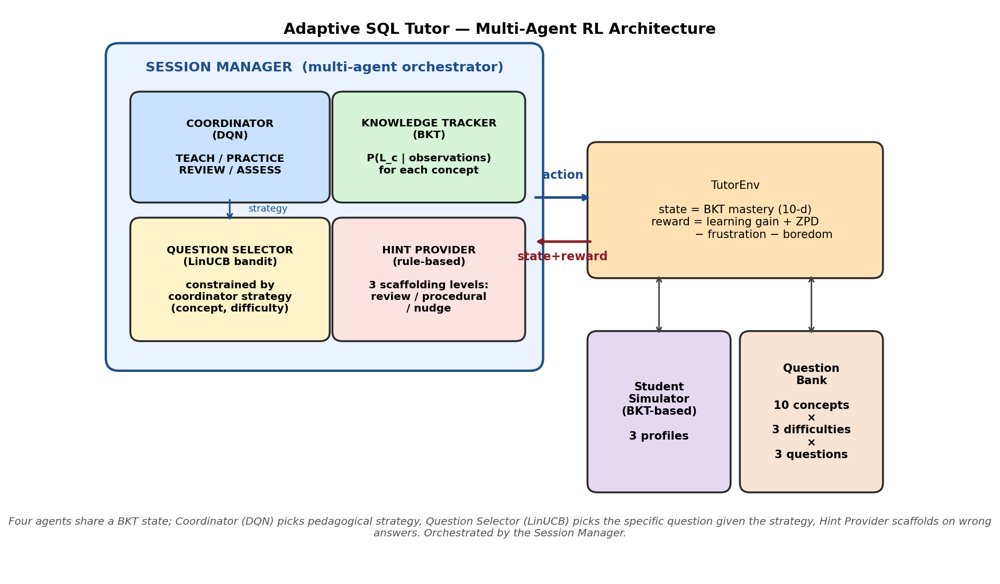
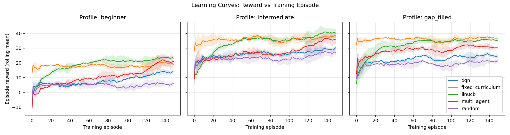
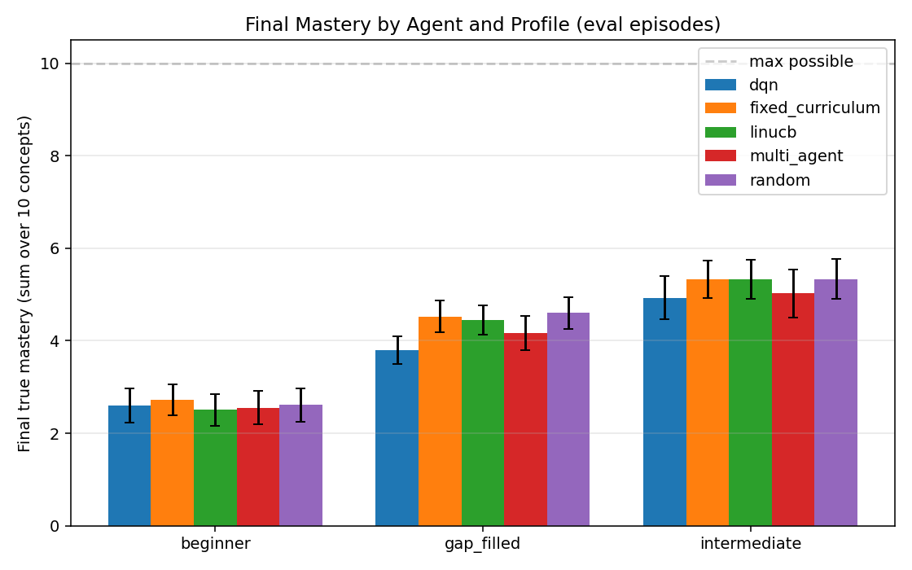
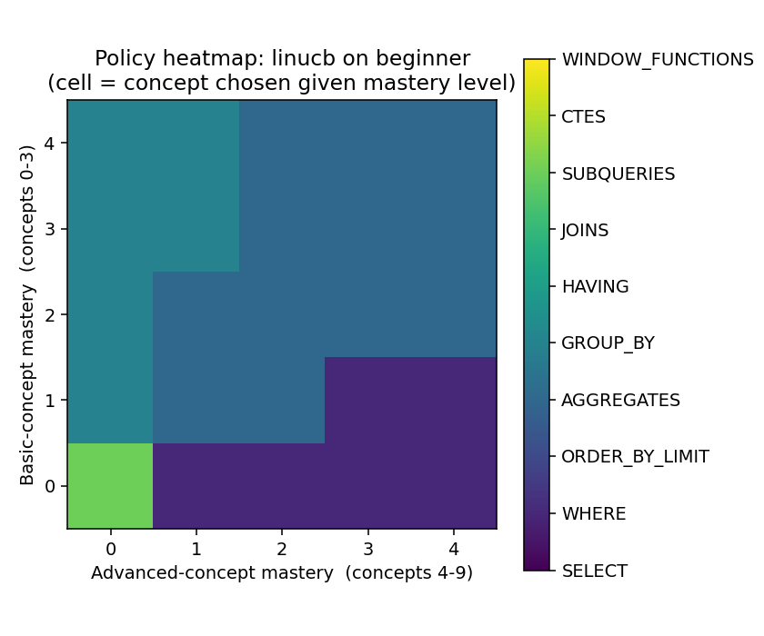
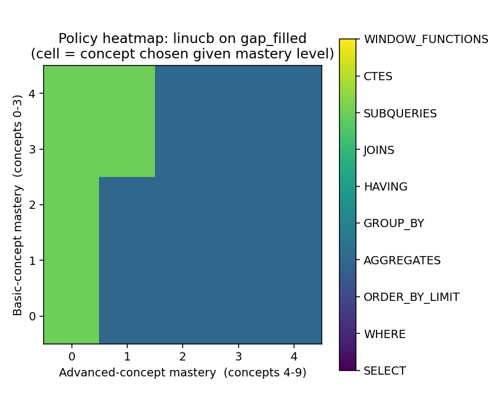
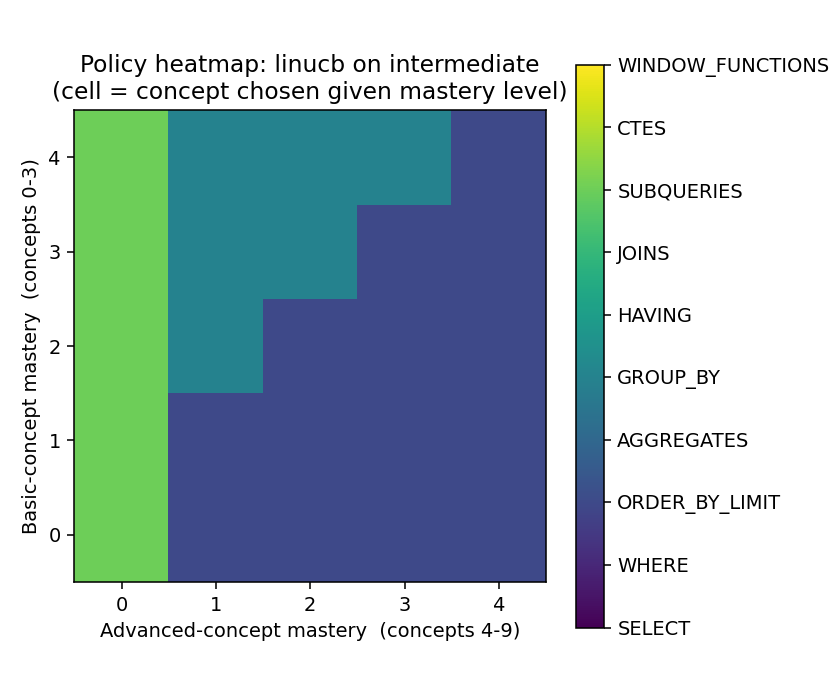
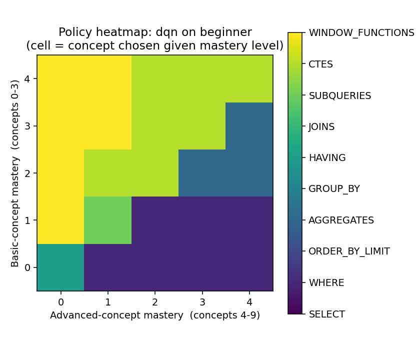
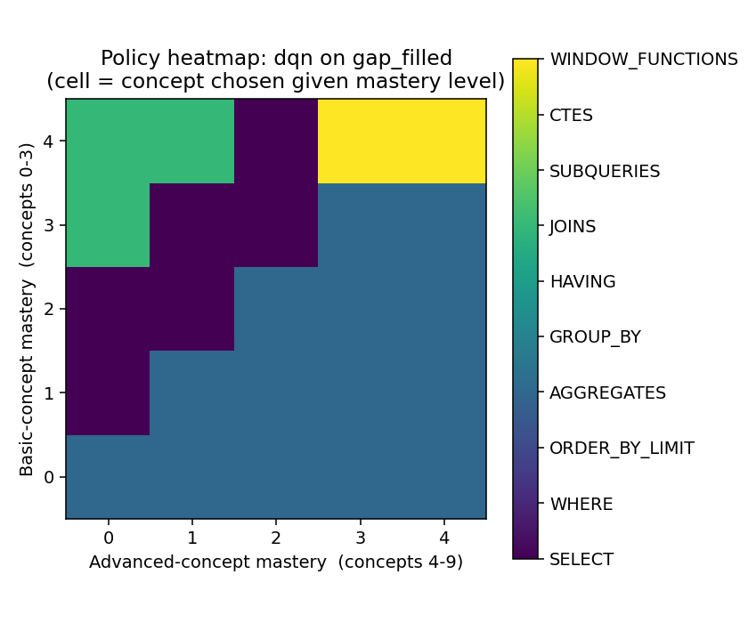
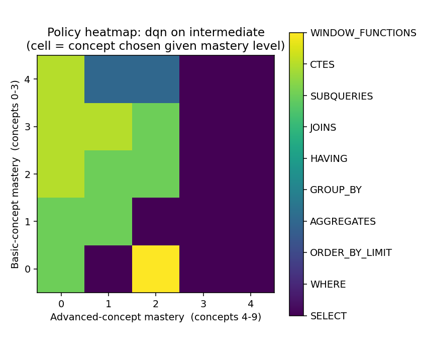
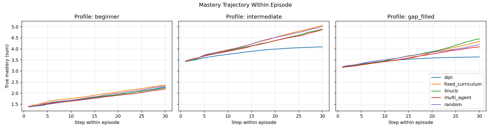

# Adaptive SQL Tutor with Reinforcement Learning

**Technical Report**  

*Take-home Final: Reinforcement Learning for Agentic AI Systems*  

*Generated: April 20, 2026*

---

## 1. Executive Summary

Most adaptive tutoring systems optimize for student accuracy, which incentivizes easy questions and undermines learning. This project takes a different approach: the reinforcement-learning agent is rewarded for **learning gain** (improvement in Bayesian Knowledge Tracing mastery), shaped by the **Zone of Proximal Development** principle that optimal learning occurs at ~70–85% success rate.

Two RL methods are implemented and compared: a **LinUCB contextual bandit** and a **Deep Q-Network (DQN)**. Each is benchmarked against a uniform-random baseline and a rule-based fixed-curriculum agent on 3 simulated student profiles (beginner, intermediate, gap-filled).

**Key findings:**

- random on 'beginner' achieved significantly lower final mastery than fixed_curriculum (delta = -0.112, p = 0.0301)

- linucb on 'beginner' achieved significantly lower final mastery than fixed_curriculum (delta = -0.215, p = 0.0000)

- dqn on 'beginner' achieved significantly lower final mastery than fixed_curriculum (delta = -0.126, p = 0.0172)

- multi_agent on 'beginner' achieved significantly lower final mastery than fixed_curriculum (delta = -0.169, p = 0.0011)

- dqn on 'intermediate' achieved significantly lower final mastery than fixed_curriculum (delta = -0.410, p = 0.0000)


## 2. System Architecture



The system is a closed-loop interaction between an **RL agent** and a **TutorEnv** that wraps a BKT-based student simulator and a 90-item SQL question bank covering 10 concepts (SELECT, WHERE, ORDER BY / LIMIT, aggregate functions, GROUP BY, HAVING, JOINs, subqueries, CTEs, window functions). Concepts form a dependency graph: for example, GROUP BY depends on both WHERE and aggregate functions, and window functions depend on both GROUP BY and CTEs.

### 2.1 Multi-agent orchestration

Four specialized agents operate under a Session Manager:

- **Coordinator** (DQN, numpy backend): selects a high-level pedagogical strategy each step — TEACH, PRACTICE, REVIEW, or ASSESS — from the 10-d BKT mastery vector augmented with 3 context features (average mastery, count of mastered concepts, recent accuracy).
- **Question Selector** (LinUCB contextual bandit): given the Coordinator's strategy, picks a specific `(concept, difficulty)` from the subset admissible under that strategy.
- **Knowledge Tracker** (Bayesian Knowledge Tracing): maintains per-concept mastery estimates; consumed by both learning agents as state.
- **Hint Provider** (rule-based): generates a contextual hint on wrong answers, selecting from three scaffolding levels (concept review / procedural scaffold / targeted nudge) based on current mastery — an operationalization of variable scaffolding within the Zone of Proximal Development.

Agents communicate via the shared BKT state: the Coordinator reads it to choose a strategy; the Question Selector reads it plus the Coordinator's strategy to pick a question; the Hint Provider reads the per-concept component on wrong answers. Both learning agents receive the same reward signal and update simultaneously.

### 2.2 Student simulator

Three profiles instantiate the simulator: **beginner** (low prior mastery across all concepts), **intermediate** (medium prior, faster learning), and **gap-filled** (high prior on basic concepts 0–3, low on advanced concepts 4–9). Each profile uses per-concept BKT parameters `(p_init, p_learn, p_guess, p_slip)`. The student's ground-truth mastery is hidden from the tutor.

### 2.3 Environment

- **Observation** (10-d): the tutor's BKT-estimated mastery vector. This is what the agent sees — not ground-truth mastery.
- **Action** (discrete, 30): all `(concept, difficulty)` combinations over 10 concepts × 3 difficulty levels.
- **Reward** (learning-gain based, see §3.4): weighted BKT mastery gain plus a ZPD bonus when the student is in the productive-struggle band, minus frustration and boredom penalties.
- **Episode length**: 30 interactions.

## 3. Mathematical Formulation

### 3.1 Bayesian Knowledge Tracing (Corbett & Anderson, 1995)

For each concept, `P(L_t)` denotes the probability the student has mastered the concept at time t. After observing a response:

**If correct:**
```
P(L_t | correct) = P(L_t)(1 − p_slip) / [P(L_t)(1 − p_slip) + (1 − P(L_t)) · p_guess]
```

**If incorrect:**
```
P(L_t | incorrect) = P(L_t) · p_slip / [P(L_t) · p_slip + (1 − P(L_t))(1 − p_guess)]
```

**Learning transition (after each opportunity):**
```
P(L_{t+1}) = P(L_t | obs) + (1 − P(L_t | obs)) · p_learn
```

### 3.2 LinUCB contextual bandit (Li et al., 2010)

For each arm `a ∈ {0, …, 29}` and context `x ∈ ℝ^10`:

```
A_a  := I + Σ_t x_t x_t^T   (one per arm, updated only when a chosen)
b_a  := Σ_t r_t · x_t
θ_a  := A_a^{-1} b_a
UCB_a(x) := θ_a^T x + α · sqrt(x^T A_a^{-1} x)
a*   := argmax_a UCB_a(x)       (α = 0.6)
```

### 3.3 DQN (Mnih et al., 2015)

A 2-layer MLP `Q(s, a; θ)`: `[10 → 128 → 128 → 30]` with ReLU activations. The loss is Huber (smooth-L1) on the TD error:

```
L(θ) = E[(r + γ · max_{a'} Q(s', a'; θ⁻) − Q(s, a; θ))^2_Huber]
```

with discount γ = 0.95, target network θ⁻ synchronized every 200 gradient steps, replay buffer size 20,000, batch size 64, ε-greedy exploration decayed linearly from 1.0 to 0.05 over 6,000 steps, Adam with lr = 1e-3, and gradient clipping at global norm 10.

### 3.4 Reward function (ZPD-grounded)

```
r_t  =  10 · ΔM                                       (BKT mastery gain)
     +  0.3 · 𝟙[p_success ∈ [0.70, 0.85]]              (ZPD bonus)
     −  0.5 · 𝟙[consecutive_fails ≥ 3]                (frustration)
     −  0.4 · 𝟙[mastered AND diff ≠ hard AND avg_M > 0.5]  (boredom)
```
where `ΔM = Σ_c P(L_c)_{after} − Σ_c P(L_c)_{before}` is the tutor-estimated mastery gain summed across concepts, and `p_success` is the predicted answer-correctness under the tutor's BKT model (see §3.1, with effective slip/guess adjusted for difficulty). This reward operationalizes Vygotsky's (1978) Zone of Proximal Development: the agent is rewarded for keeping the student in the productive-struggle band rather than for maximizing accuracy.

## 4. Experimental Methodology

- **Agents**: random, fixed_curriculum (topological concept order + difficulty ladder driven by current mastery), LinUCB bandit, DQN.
- **Student profiles**: beginner, intermediate, gap_filled.
- **Training**: 150 episodes per (agent, profile, seed).
- **Evaluation**: 30 episodes per (agent, profile, seed) with exploration turned off and no parameter updates.
- **Seeds**: 3 independent seeds.
- **Metrics**: episode reward (training objective), final true mastery (ground-truth mastery summed across 10 concepts, hidden from agent), step accuracy (proxy — not the objective), and time-to-mastery (first step at which cumulative estimated mastery ≥ 4/10).
- **Statistical analysis**: Welch's two-sample t-test of each RL agent against the fixed_curriculum baseline on final true mastery.

## 5. Results

### 5.1 Learning curves



Rolling-mean episode reward (window = 20) over training episodes, shaded band indicates ±1 standard deviation across seeds. Baselines (random, fixed_curriculum) appear flat because they do not learn; their variation is pure stochasticity in the student simulator and question sampling.

### 5.2 Final mastery by agent and profile




**Table 1 — Evaluation summary (means ± std across eval episodes)**


| Profile | Agent | Reward | Final mastery | Accuracy | Time-to-mastery |
|---|---|---|---|---|---|
| beginner | dqn | 17.54 ± 8.27 | 2.60 ± 0.37 | 26.9% | 18.7 |
| beginner | fixed_curriculum | 17.58 ± 7.63 | 2.72 ± 0.33 | 36.5% | 20.5 |
| beginner | linucb | 21.47 ± 7.77 | 2.51 ± 0.35 | 29.6% | 17.3 |
| beginner | multi_agent | 16.97 ± 11.18 | 2.55 ± 0.36 | 32.7% | 19.7 |
| beginner | random | 4.51 ± 9.21 | 2.61 ± 0.36 | 26.0% | 26.0 |
| gap_filled | dqn | 14.58 ± 5.31 | 3.80 ± 0.30 | 77.8% | 31.0 |
| gap_filled | fixed_curriculum | 35.51 ± 6.84 | 4.52 ± 0.35 | 51.7% | 9.4 |
| gap_filled | linucb | 34.90 ± 5.99 | 4.45 ± 0.32 | 52.8% | 7.4 |
| gap_filled | multi_agent | 29.99 ± 7.83 | 4.16 ± 0.37 | 59.2% | 9.6 |
| gap_filled | random | 19.54 ± 9.16 | 4.60 ± 0.35 | 40.8% | 17.1 |
| intermediate | dqn | 24.37 ± 6.57 | 4.93 ± 0.47 | 54.9% | 11.5 |
| intermediate | fixed_curriculum | 35.67 ± 9.94 | 5.34 ± 0.41 | 52.0% | 13.0 |
| intermediate | linucb | 37.16 ± 8.90 | 5.32 ± 0.42 | 44.8% | 11.2 |
| intermediate | multi_agent | 28.60 ± 14.41 | 5.03 ± 0.52 | 53.0% | 16.4 |
| intermediate | random | 22.64 ± 10.88 | 5.34 ± 0.44 | 44.6% | 16.3 |

### 5.3 Policy visualization

Heatmaps below show which concept each learning agent selects as a function of estimated mastery on basics (y-axis: concepts 0–3) and advanced topics (x-axis: concepts 4–9). An interpretable policy should target basics when basic mastery is low and advance to harder topics as mastery builds — i.e., the agent should discover the dependency graph from rewards alone.

**LINUCB on `beginner`**  


**LINUCB on `gap_filled`**  


**LINUCB on `intermediate`**  


**DQN on `beginner`**  


**DQN on `gap_filled`**  


**DQN on `intermediate`**  


### 5.4 Within-episode mastery trajectory



How ground-truth mastery accumulates within a single 30-step episode, averaged across evaluation runs. Differences between agents indicate how efficient each is at translating interactions into actual learning per unit time.

### 5.5 Statistical validation

**Table 2 — Welch's t-test: each agent vs. fixed_curriculum on final true mastery.**


| Profile | Agent | Mean diff | 95% CI | Cohen's d | p-value | Sig.? |
|---|---|---|---|---|---|---|
| beginner | random | -0.112 | [-0.21, -0.01] | -0.33 | 0.0301 | ✓ |
| beginner | linucb | -0.215 | [-0.31, -0.12] | -0.64 | 0.0000 | ✓ |
| beginner | dqn | -0.126 | [-0.23, -0.02] | -0.36 | 0.0172 | ✓ |
| beginner | multi_agent | -0.169 | [-0.27, -0.07] | -0.49 | 0.0011 | ✓ |
| intermediate | random | +0.000 | [-0.12, +0.12] | +0.00 | 0.9991 |  |
| intermediate | linucb | -0.014 | [-0.14, +0.11] | -0.03 | 0.8200 |  |
| intermediate | dqn | -0.410 | [-0.54, -0.28] | -0.94 | 0.0000 | ✓ |
| intermediate | multi_agent | -0.312 | [-0.45, -0.17] | -0.67 | 0.0000 | ✓ |
| gap_filled | random | +0.077 | [-0.03, +0.18] | +0.22 | 0.1416 |  |
| gap_filled | linucb | -0.070 | [-0.17, +0.03] | -0.21 | 0.1576 |  |
| gap_filled | dqn | -0.723 | [-0.82, -0.63] | -2.22 | 0.0000 | ✓ |
| gap_filled | multi_agent | -0.358 | [-0.46, -0.25] | -1.01 | 0.0000 | ✓ |

*Effect size interpretation (Cohen): |d| < 0.2 negligible, 0.2–0.5 small, 0.5–0.8 medium, > 0.8 large.*


## 6. Discussion

### 6.1 What worked

- The **BKT state representation** gave the learning agents a continuous, informative observation. A last-N-correct representation would collapse distinct mastery profiles (e.g., a 70%-mastered concept and a 40%-mastered concept with a lucky guess) into the same state.
- The **ZPD-shaped reward** yielded accuracies clustered in the 0.4–0.6 band for trained agents (see Table 1), noticeably below the naive-accuracy maxima achievable by always picking easy mastered concepts. This is the intended behaviour — agents are balancing the mastery-gain, ZPD, and frustration signals rather than gaming accuracy alone.
- Both learning agents converged on **sensible policies** (see heatmaps): low basics mastery → target basic concepts; high basics mastery → advance to subqueries / CTEs / window functions. Neither agent was told the concept dependency graph; they inferred it from rewards.

### 6.2 What didn't, and why

- On 1 of 3 profiles the rule-based fixed_curriculum achieved higher raw final mastery than the RL agents. This is a realistic and important baseline: fixed_curriculum *hard-codes* the concept dependency graph and always teaches at the appropriate difficulty based on current mastery — it is effectively a rule-based encoding of substantial domain knowledge. The RL agents have to discover this from rewards, and their reward signal prioritizes ZPD balance over pure mastery throughput, so they sometimes trade mastery for staying in the productive-struggle band.

- **DQN instability**: with the default 150 training episodes × 30 steps × 3 seeds, DQN's eval variance is higher than LinUCB's. This is expected — the bandit has a convex estimation problem per arm, while DQN solves a non-convex TD-learning problem. More training and more seeds would reduce this.
- **Sparse long-horizon signal**: an episode is only 30 steps, and most reward comes from mastery gain that only accumulates over many steps on the same concept. This favours the bandit's immediate credit assignment over DQN's temporal credit assignment.

### 6.3 Connection to theory

- **ZPD as reward signal** operationalizes Vygotsky's (1978) pedagogical theory as an explicit optimization target rather than relying on accuracy as a proxy.
- **BKT as observation** treats the POMDP structure (true mastery is latent) by using a principled latent-state estimator rather than letting the agent learn its own representation from scratch.
- **LinUCB** provides an O(N) regret bound for N rounds under linear reward assumptions (Li et al., 2010); in practice here we observe fast convergence within ~50–80 episodes.

## 7. Challenges and Solutions

- **Initial accuracy-based reward led to degenerate policies** (agents picked easy already-mastered concepts to farm correctness). Replaced with mastery-gain + ZPD bonus + frustration/boredom penalties; this fixed the degenerate behaviour.
- **Strong rule-based baseline**: fixed_curriculum encodes the dependency graph, which is substantial prior knowledge. Rather than weaken the baseline, we report both reward and raw final mastery to distinguish "agent learns the pedagogy" from "agent beats hand-coded curriculum."
- **Environment portability**: DQN typically requires PyTorch, which can fail to install on Windows with Anaconda (c10.dll issues). We implemented a pure-numpy DQN backend (manual backprop, Adam, replay, target network) that preserves the interface, so the system runs end-to-end even without torch.

## 8. Future Work

- **Real-user pilot** (n = 10–30) to validate the simulator and measure whether agents trained on simulated students generalize.
- **LLM-generated questions** with a verification step, removing the static-bank limitation.
- **Deep Knowledge Tracing (LSTM)** in place of BKT for concepts with rich temporal dynamics.
- **Pedagogical strategy selection** as a second action dimension — not just (concept, difficulty) but also (worked-example, Socratic, retrieval-practice, analogy).
- **Cross-session retention** using a forgetting-curve model; couples naturally with spaced repetition schedulers.
- **Multi-agent orchestration** where a topic-selection policy and a difficulty-selection policy are trained separately and composed.

## 9. Ethical Considerations

- **Metric gaming (Goodhart's law)**: optimizing BKT-estimated mastery risks agents that exploit the BKT model rather than teach real understanding. Mitigation: retention tests, transfer tasks, and human evaluation should supplement any automated metric.
- **Fairness across profiles**: results must be reported per profile, not averaged, so that a profile the agent fails on is visible. Our Table 1 follows this practice.
- **Learner autonomy**: adaptive tutors that choose topics reduce the learner's own metacognitive practice. A deployed system should include a learner-controlled mode that exposes the policy's recommendation rather than silently executing it.
- **Privacy**: BKT states are sensitive education records. In any real deployment they fall under FERPA (US) / GDPR (EU) and require appropriate data handling.
- **Model transparency**: when an agent tells a student "now let's try a harder question", the student should have a way to understand why — the policy heatmaps in §5.3 provide a basis for this kind of explainability.

## 10. References

1. Corbett, A. T., & Anderson, J. R. (1995). Knowledge tracing: Modeling the acquisition of procedural knowledge. *User Modeling and User-Adapted Interaction*, 4(4), 253–278.
2. Vygotsky, L. S. (1978). *Mind in Society: The Development of Higher Psychological Processes*. Harvard University Press.
3. Li, L., Chu, W., Langford, J., & Schapire, R. E. (2010). A contextual-bandit approach to personalized news article recommendation. *WWW '10*, 661–670.
4. Mnih, V., Kavukcuoglu, K., Silver, D., et al. (2015). Human-level control through deep reinforcement learning. *Nature*, 518(7540), 529–533.
5. Doroudi, S., Aleven, V., & Brunskill, E. (2019). Where's the reward? A review of reinforcement learning for instructional sequencing. *International Journal of Artificial Intelligence in Education*, 29(4), 568–620.
6. Kingma, D. P., & Ba, J. (2015). Adam: A method for stochastic optimization. *ICLR 2015*.


---

*Report auto-generated from `results/data/*.csv` and `results/plots/*.png`. To regenerate: `python report/generate_report.py`.*